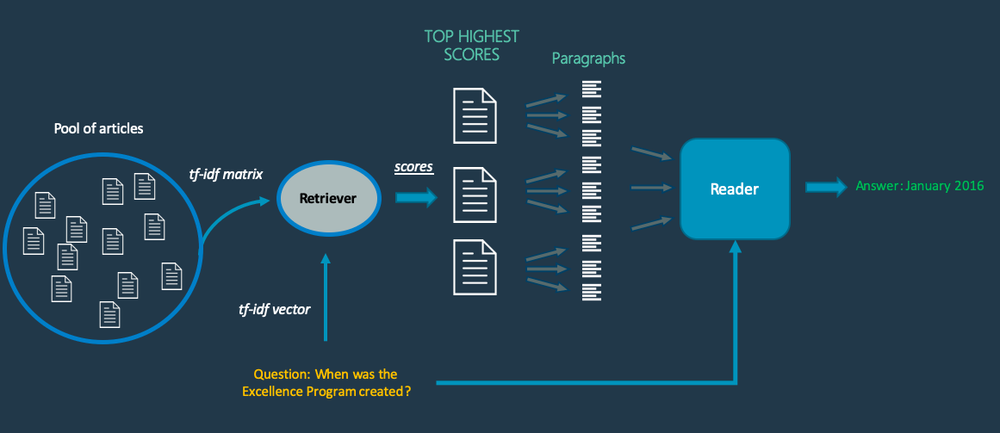
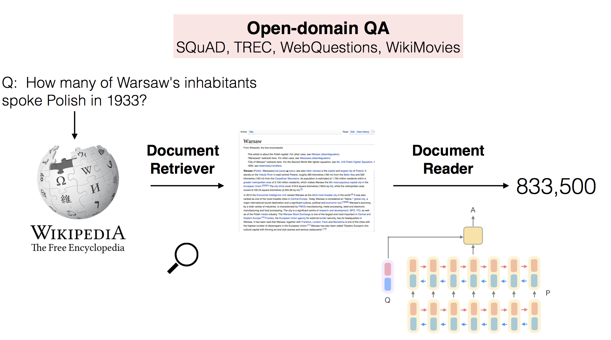

% Question Answering Systems 
% Sudhanshu Dubey
% 8th Feb 2021

# Introduction to Question Answering Systems

## What are QA Systems?

- "Question Answering is a human-machine interaction to extract information from data using natural language queries."
- This simply means that it's a "software" that can answer questions asked in human language.
- If you ask a "software" "Where is CAIR located?" and it tells you "Banglore, India" then it's a QA system.

## QA System vs Search Engines

| Google | Ecosia |
|---|---|
|  |  |

## Evolution of QA Systems

- The concept of QA can be traced back to the emergence of AI with the famous Turing Test.
- Early works on QA mainly relied on manually-designed syntactic rules to answer simple answers due to constrained computing resources.
- A major event in this field was IBM's Watson winning the Jeopardy! quiz show in 2011.
- With the recent developments in Deep Learning and computing resources, NLP and QA systems have gained pace.

# Broad Categories

## Based on Domain (Scope)

- **Closed Domain**: The system can answer questions from a specific field. Ex: [BASEBALL and LUNAR](https://en.wikipedia.org/wiki/Question_answering#History)
- **Open Domain**: The system can answer questions from any general field. Ex: [Facebook's DrQA](https://research.fb.com/downloads/drqa/)

## Based on Data Source

- **Structured Data**: Highly organised data in the form of Knowledge Graphs. Ex: [Google Knowledge Graph](https://en.wikipedia.org/wiki/Google_Knowledge_Graph) and [GraphQA](https://github.com/yuzhiliu/graphqa)
- **Semi-Structured Data**: Data organised in the form of lists and tables. Ex: [QuASM](http://ciir.cs.umass.edu/pubfiles/ir-244.pdf) and [TableILP](https://github.com/allenai/tableilp)
- **Unstructured Data**: Unorganised data present as plain text usually in natural language. Ex: Facebook's DrQA.

## Based on Question Types

- **Factual**: Questions starting with Wh-interrogated word (what, where, when, etc).
- **List**: Questions asking for examples.
- **Definition**: Questions asking to define something.
- **Hypothetical**: Situation based questions.
- **Confirmation**: Yes/No type questions.

- Currently, most QA systems answer factual questions.

## Based on Answer Types

- **Extractive**: The answer is a span of text, word or entity which is extracted from relevant documents.
- **Generative**: The answer is generated by the system itself.

## Based on Methodologies

- **Knowledge Base based**: The idea is to answer a natural language question by mapping it to a query over a structured database. The logical form of the question is thus either in the form of a query or can easily be converted into one. Ex: [WebQuestions](https://cs.stanford.edu/~pliang/papers/freebase-emnlp2013.pdf)
- **Information Retrieval based**: The idea is to answer a user’s question by finding short text segments from the given collection of documents. Ex: [IR based QA](https://ieeexplore.ieee.org/abstract/document/5764111)
- **Natural Language Processing based**: NLP based models aim to extract candidate answer strings from the context document and re-rank them by semantic matching. Ex: [DocumentQA](https://github.com/allenai/document-qa)

# Major Methodologies 

## Knowledge Base based

- A knowledge base (KB) is a technology used to store complex structured and unstructured information used by a computer system.
- Two common paradigms are used for knowledge-based QA:

	1. *Graph-Based*: This  models the knowledge base as a graph, often with entities as nodes and relations or propositions as edges between nodes. A simple case is of RDF triples, like (CAIR, location, Bangalore) using which we can answer questions like "Where is CAIR located?" and "What is situated in Bangalore?"
	1. *Semantic Parsing*: The second kind of knowledge-based QA uses a semantic parser to map the question to a structured program to produce an answer. For example "How many people work at CAIR?" can be parser to `count(employee_list("CAIR"))`.

## Information Retrieval based

- The goal of IR-based QA is to answer a user’s question by finding short text segments from the web or some other large collection of documents.
- The dominant paradigm for IR-based QA is the retrieve and read model.
- In the first stage of this 2-stage model we retrieve relevant passages from a text collection, usually using a search engine.
- In the second stage, a neural reading comprehension algorithm passes over each passage and finds spans that are likely to answer the question.

## Natural Language Processing Based

- NLP based QAs are an advancement of IR based QAs.
- After the document retrieval, it ranks the paragraphs. Then the QA systems can locate candidate answers from top ranked paragraphs through the reading comprehension model. Finally, the final answer is selected.
- One thing to note is that NLP based QA systems these days use advanced deep learning models along with NLP techniques for each phase which makes them more advanced as compared to other methodologies.

# Some Case Studies

## cdQA-Suite

- It is an end-to-end, closed domain, NLP based QA system suite built on top of the HuggingFace [transformers](https://github.com/huggingface/transformers) library in Python.

- The Reader is a deep learning model [BERT](https://github.com/huggingface/pytorch-pretrained-BERT) pre-trained on SQuAD 1.1 dataset and can be further fine-tuned on a dataset having similar format.

## [Open-Domain QA using DistilBERT](https://programmerbackpack.com/bert-nlp-using-distilbert-to-build-a-question-answering-system/)

- It is an open domain, NLP based small QA system that uses a pre-collected set of Wikipedia articles as it's data source.
- It first collects the articles and extracts texts from it passing it to spaCy's NLP model to process and store as sentences.
- Then it does the same processing on the question (stop word removal and lemmatisation) and stores it.
- After that, it uses BM25 ranking algorithm to search and fetch the most relevant sentences (context) to the question from the prepared dataset.
- Finally, it uses the DistilBERT (a lightweight version of BERT) to find the answer from the context.

## DrQA

- It is an open-domain, NLP based QA system that uses the whole of Wikipedia to answer factoid questions.
- It has two components:
	1. *Document Retriever*: It uses bigram hashing and TF-IDF ranking algorithm to fetch relevant documents efficiently.
	1. *Document Reader*: It is a multi-layer recurrent neural network machine comprehension model trained to do extractive question answering. It is primarily trained on SQuAD datatset.

# Challenges 

## Related to NLP

- **Lexical Gap**: Questions in natural language can be expressed in multiples ways. The difference can be as simple as using synonyms like "Who is the founder of Linkin Park?" and "Who created Linkin Park?" to completely different questions having same context and answers like "Who is the current president of USA?" and "Who succeeded Donald Trump as USA's president?"

- **Ambiguity**: In English, a word can have multiple meanings and so it can lead to similar looking questions with entirely different meanings like "Where is Bank of Baroda ATM?" and "On which river's bank is Baroda situated?". These can be solved to some extent with word sense disambiguation and POS tagging.

##

- **Multilinguism**: Currently NLP is not as evolved for other languages as it is for English.

- **Question Types**: With the current technologies, only factoid questions can be answered. Hypothetical, confirmation and inference type questions can be answered. Also generative answers can't be generated as of now.

## Related to Deep Learning

- **Interpretability**: It is well-known that the process of deep learning likes a black-box. This makes debugging and modification difficult.

- **Data Hungry**: Deep learning models are data driven, the more the better. But it is costly and time consuming to build large datasets, even with annotation tools available.

- **Resource Hungry**: Deep learning models need large resources, especially for training. This prevents the adoption of QA models on mobile devices.

# Scope for Further Work

- **Complex Reasoning**: With larger datasets, the QA systems need to be able to derive answers by combining multiple documents and using deductive reasoning on them.

- **Complexity Improvement**: The deep learning models can be improved to perform better on lower hardware configurations.

- **Multiple Linguistic Support**: Languages other than English can be enabled for asking questions resulting in a wider user base.

# Thanks !!!
