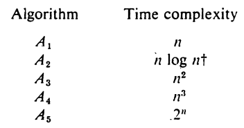
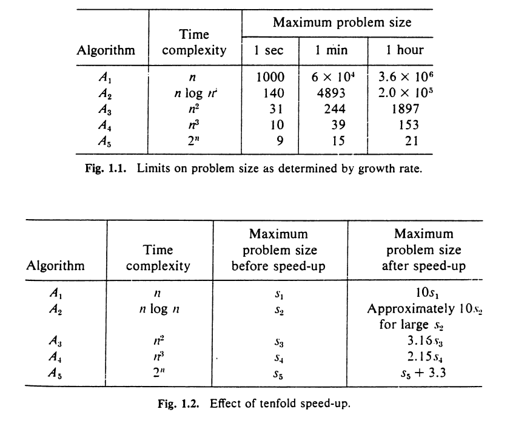

% Complexity Analysis of Algorithm 
% Sudhanshu Dubey
% D3 CSE B1 | 1706523

# What !?

## What's an Algorithm?

- It's a *well defined* **sequence of steps** to solve a problem.
- Or basically instructions for the dumbest person in the world, the computer.

## ... and Complexity?

> the state of being difficult to understand

## Complexity of Algorithm

- Analysis helps us to understand *how difficult it is for the computer to understand/implement the algorithm*.

# Why !?

## Why complexity analysis?

- A problem maybe solved using various algorithms.
- We need to find the best way of solving the problem so that minimum resources are used up.

## ... even with superfast computers?

- Absolutely!!!
- Let's take an example. A problem can be solved using these algorithms:

---

---

- So it's clear from above that using a more efficient algorithm is much more benificial than having a faster processor.

# How !?

## How to find complexity?

- There are 2 types of complexities that we are intrested in:
	1. Space Complexity
	1. Time Complexity
- Both of these complexities can be evaluated using various criteria, but we will be focusing on the **rate of growth**.
- Rate of growth is basically how much the complexity changes w.r.t the input size.

## How to find rate of growth?

- We have to realize that the idea of complexity is an abstract one and no value can be actually associated with it.
- We can only relatively compare the growth of our algorithms with the growth of some mathematical function.
- And for this comparison, we use **Asymptotic Notations**.

# Thanks
