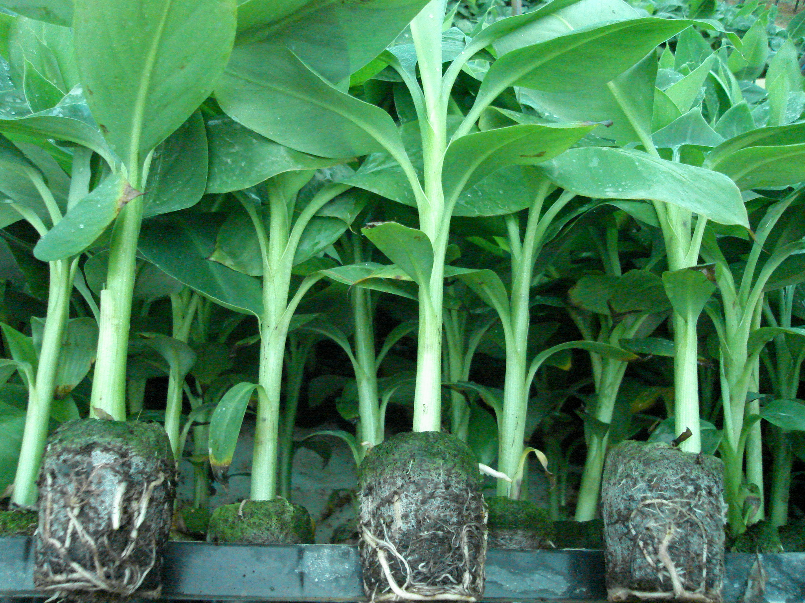
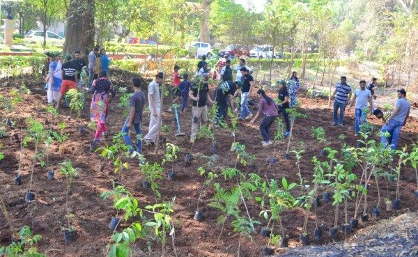

% Miyawaki Forest Creation Technique
% Sudhanshu And Alok
% 16th Mar 2019

# Current Environmental Problems

- Air Pollution
- Soil Erosion
- Loss of Habitat
- Global Warming
- Species Getting Endangered

# The Best Solution

- Plant Trees or Afforestrastion

# Problem in the SOlution

- Less Space
- Non-native species
- Less Maintainance
- Sterile Soil

# New Solution

- Miyawaki Forest Technique

# Steps of Miyawaki Technique

# Survey the native species

# Identify the soil’s nutrition and fertility

# Collecting/Buying saplings

# Soil Preparation

# Preparing Jeevamrit

# Plantation

