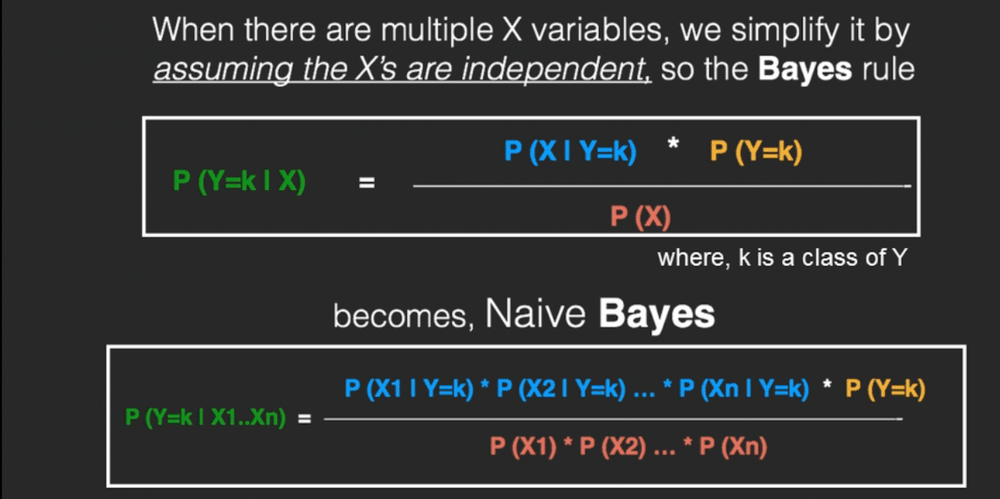

% 6 Weeks Industrial Training 
% Sudhanshu Dubey
% 25th Nov 2019

# The Company

## [Nebero Systems Pvt. Ltd](http://www.nebero.com/)

- Young and skilled Staff
- Easy working environment
- **Linux oriented**

# The Project

##
- Spam filtration using ML 
- My first python and ML project

## The Workflow

- I was on my own
- Interaction through mails
- Daily reports

## The Naive Bayes Algorithm

##

##

##

## The Data Flow

##

## Blogs

- [Read all about my training](https://hacksd.wordpress.com/2019/06/05/day-1-of-summer-internship/)

# Thanks
